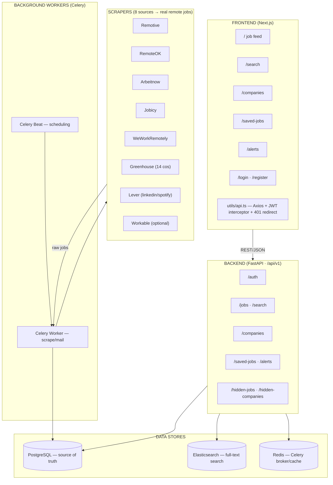

# RemoteJobHub — Project Workflow

This document describes how the RemoteJobHub remote job aggregator works end-to-end: from data ingestion through serving, searching, and notification.

## System Architecture



## End-to-End Workflow

### 1. Data Ingestion (Scraping)
- **Celery Beat** schedules `scrape_all_jobs` every `SCRAPING_INTERVAL_HOURS` (default 1h).
- `ScraperManager` runs **8 scrapers concurrently** via `asyncio.gather`, each isolated so a single failure does not abort the run.
- Sources: Remotive, RemoteOK, Arbeitnow, Jobicy, WeWorkRemotely (boards) + Greenhouse, Lever, Workable (ATS APIs).
- Result: **~1,170 real, legitimate remote jobs** per scrape cycle.

### 2. Deduplication + Persistence (`scraping_tasks.py`)
```
fetch raw
  → AIEnrichmentService.enrich_job()    # optional OpenAI salary/summary
  → upsert into PostgreSQL             # dedupe on source_url
      → insert new / update existing
  → index each job into Elasticsearch
  → trigger instant alerts for new jobs
```

### 3. Data Serving (FastAPI Routes)
| Route | Purpose |
|-------|---------|
| `/auth` | register, login (JWT), profile, change password |
| `/jobs` | paginated job feed with filters (category, remote, experience, salary, skills) |
| `/search` | Elasticsearch full-text search + autocomplete suggestions |
| `/companies` | company list, detail, aggregated stats (SQL counts/avg) |
| `/saved-jobs` | per-user saved jobs (N+1-optimized JOIN) |
| `/alerts` | per-user job-alert CRUD (limit 5 for free users) |
| `/hidden-*` | hide jobs/companies per user |

### 4. Frontend (Next.js)
```
User loads /
  → fetchJobs() via utils/api.ts
      → Axios attaches Bearer JWT from localStorage
      → 401 → interceptor clears token, redirects to /login

User actions:
  Save job  → saveJob() / unsaveJob()
  Hide job  → hideJob()
  Filter    → fetchJobs(filters)
  Search    → searchJobs() / getSuggestions()
  Alerts    → getAlerts() / createAlert() / updateAlert() / deleteAlert()
```

### 5. Notifications
- `send_instant_alert` (Celery) matches new jobs against active alerts → email (SMTP).

## Deployment Flow (`deploy.sh` + `docker-compose.yml`)

```
deploy.sh
  ├── validates/maintains .env (never commit the real .env with secrets)
  ├── docker compose build
  │     (postgres, redis, elasticsearch, backend, celery, frontend)
  └── docker compose up -d
        ├── backend: alembic upgrade head   # migrations 001→004
        ├── seed_data.py                     # 9 demo jobs (dev only)
        └── Celery Beat starts scheduled scraping
```

## Security Guarantees
- **No secrets in the repo**: the real `.env` is gitignored; only `.env.example` is committed.
- **CORS** restricted to `ALLOWED_ORIGINS`.
- **JWT** signed with a validated 32+ char `SECRET_KEY` (auto-generated if unset).
- **Rate limiting** via slowapi.
- **DB echo** only when `DEBUG=true`; timezone-aware timestamps everywhere.

## Typical Happy Path
1. Scraper pulls real jobs → stored in Postgres + indexed in Elasticsearch.
2. User registers / logs in → receives JWT.
3. User searches and filters real remote jobs → saves favorites → sets up a job alert.
4. Celery matches new jobs → emails the user.
5. All data is persisted and queryable via the REST API consumed by the Next.js UI.

## Repository Layout
```
backend/
  alembic/            # database migrations (001→004)
  app/
    api/routes/       # FastAPI route handlers
    core/             # config, database, security
    models/           # SQLAlchemy models (Job, Company, User, ...)
    scrapers/         # 8 data-source scrapers + manager
    scripts/          # seed_data, scrape_once
    services/         # auth, AI enrichment, Elasticsearch
    tasks/            # Celery scraping + alert tasks
frontend/
  components/         # UI components (Header, JobCard, ...)
  pages/              # Next.js pages
  utils/api.ts        # centralized API client
docker-compose.yml    # full stack orchestration
deploy.sh             # one-command deployment
```
